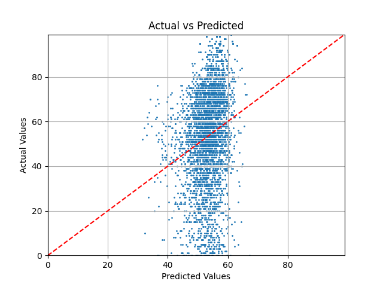
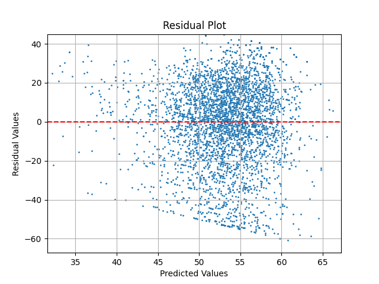

# Multiple Linear Regression in C++

small regression model in C++ from scratch using Eigen. Implements both the closed-form normal equation solution and gradient descent optimization. 

uses the spotify song popularity dataset [Kaggle](https://www.kaggle.com/datasets/yasserh/song-popularity-dataset)

### Actual vs Predicted 

### Residuals

### Metrics 

